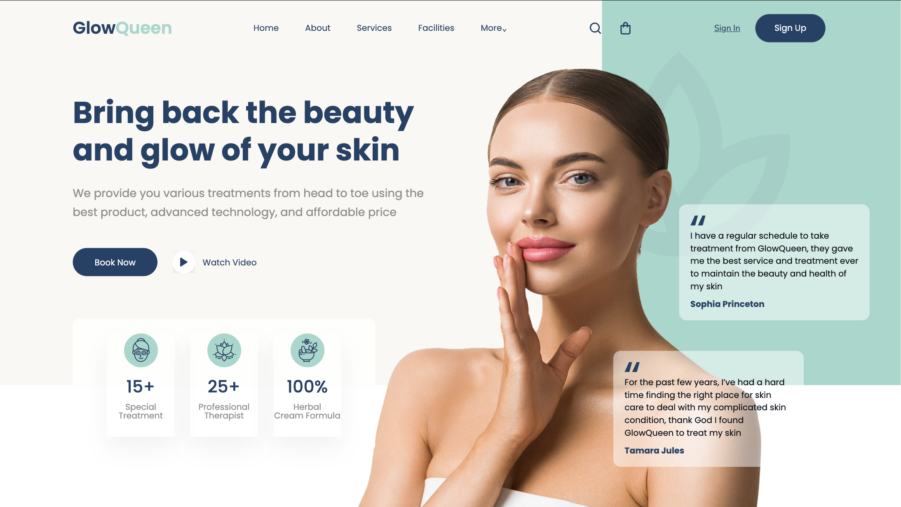

# GlowQueen — Spa & Beauty Landing Page

GlowQueen is a **Spa & Beauty landing page** developed from a Figma design, with a strong focus on visual accuracy, clean code organization, and interactive user experience.

This project is part of my front-end development practice, using **HTML, Sass, JavaScript, and Vite**.

## Preview



## Live Demo

The project is deployed with **GitHub Pages**.

> Live demo link will be added after deployment.

## Technologies

- HTML5
- Sass / SCSS
- JavaScript
- Vite
- Git & GitHub
- GitHub Pages

## Features

- Pixel-accurate implementation based on a Figma design
- Structured and modular SCSS architecture
- Reusable Sass variables for colors, typography, and font weights
- Sass mixins
- Local fonts
- Interactive navigation with active state
- Hover effects on navigation, buttons, and icons
- Hero section with decorative elements and main image
- Customer testimonial cards
- Statistics section
- Organized component and layout styles

## SCSS Structure

```text
src/
└── scss/
    ├── abstracts/
    │   ├── _mixins.scss
    │   └── _variables.scss
    │
    ├── base/
    │   ├── _reset.scss
    │   └── _typography.scss
    │
    ├── components/
    │   ├── _buttons.scss
    │   └── _stats.scss
    │
    ├── layout/
    │   ├── _header.scss
    │   └── _hero.scss
    │
    └── style.scss
```

## Design

The project was developed from a **Figma reference**, translating the original design into HTML and Sass while maintaining its visual composition, typography, spacing, and overall aesthetic.

## Author

**Neus Gil**

GitHub: **Neusgil**
